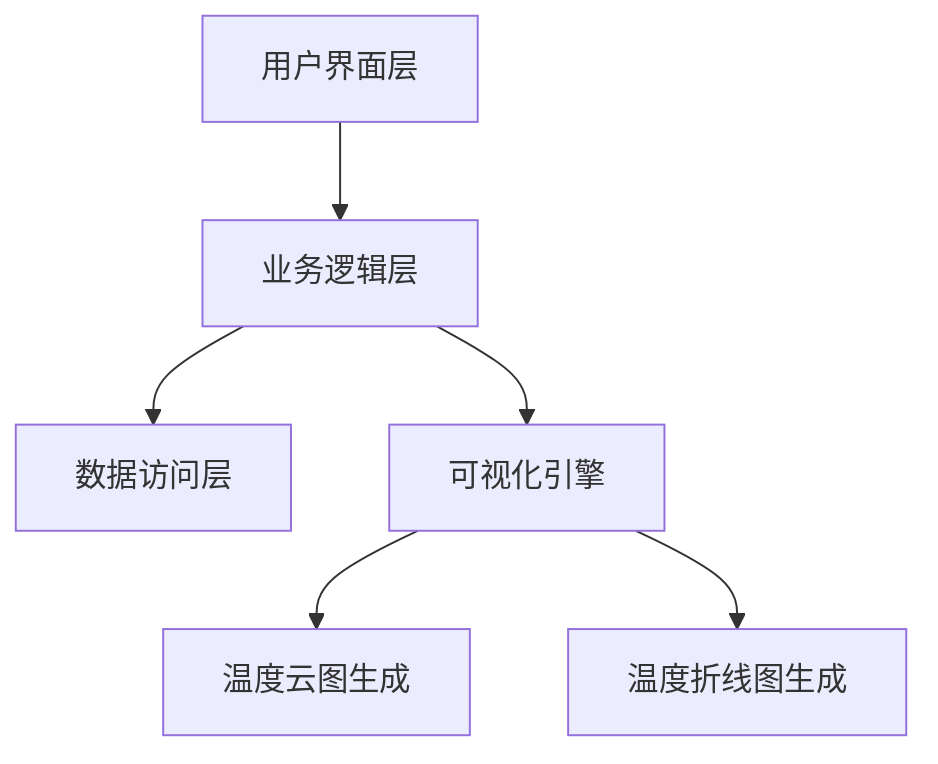
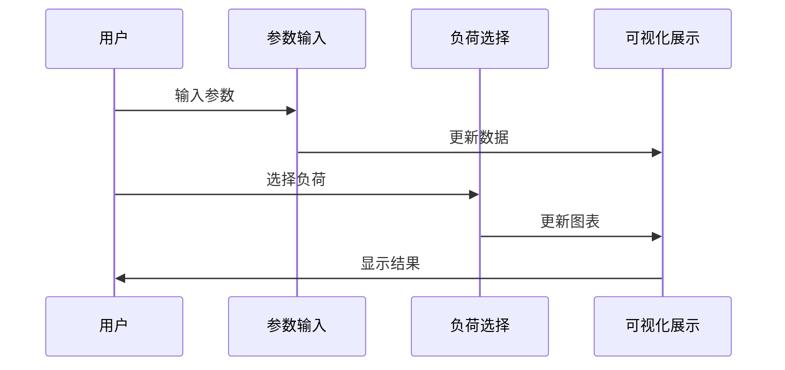

# 锅炉参数监控系统设计与实现

## 需求分析

在工业自动化快速发展的今天，锅炉作为重要的工业设备，其运行参数的实时监控和可视化展示变得尤为重要。本系统旨在开发一个基于Web的锅炉参数监控平台，通过直观的界面展示锅炉运行状态，帮助操作人员更好地理解和控制锅炉运行参数。

系统的主要功能需求包括实时参数输入、负荷比例选择以及温度可视化展示。在参数输入方面，系统需要支持八个关键参数的实时录入，包括实际耗煤量、一次风量、二次风量、燃尽风量等。这些参数对于锅炉的安全运行和效率优化至关重要。在负荷比例选择方面，系统提供了100%、75%、50%和25%四个档位的选择，以满足不同工况下的监控需求。

在可视化展示方面，系统采用温度云图和温度折线图两种方式，直观地展示锅炉内部的温度分布情况。这种多角度的可视化展示方式，有助于操作人员全面了解锅炉的运行状态。同时，系统还具备良好的用户交互体验，包括参数输入的实时验证、负荷切换时的加载动画等特性。

## 概要设计

系统的整体架构采用前后端分离的设计模式，前端使用Vue 3框架进行开发，后端采用Node.js提供API服务。这种架构设计不仅提高了系统的可维护性，也为未来的功能扩展提供了良好的基础。

在系统架构中，用户界面层负责处理用户输入和展示数据，业务逻辑层处理核心业务逻辑，数据访问层负责与后端服务进行数据交互。可视化引擎作为系统的特色模块，负责生成温度云图和折线图，为操作人员提供直观的数据展示。

系统的数据流设计采用单向数据流模式，确保数据的一致性和可预测性。当用户修改参数或选择不同的负荷比例时，系统会触发相应的数据更新流程，最终反映在可视化图表上。这种设计模式不仅提高了系统的性能，也增强了用户体验。

## 详细设计

在详细设计阶段，我们重点关注了系统的核心组件实现和交互逻辑。系统的主要组件包括参数输入组件、负荷选择组件、可视化卡片组件和加载动画组件。这些组件通过Vue 3的组合式API进行开发，实现了高度的可复用性和可维护性。

参数输入组件（ParameterInput）采用响应式设计，支持实时数据验证和格式化。该组件通过v-model实现双向数据绑定，确保数据的实时更新。负荷选择组件（LoadRatioSelector）提供了直观的按钮式界面，支持不同负荷比例的快速切换。

可视化卡片组件（VisualizationCard）负责展示温度云图和折线图，采用响应式布局，确保在不同屏幕尺寸下都能获得良好的显示效果。加载动画组件（LoadingSpinner）在数据加载过程中提供视觉反馈，提升用户体验。

## 系统测试

系统测试采用多层次的测试策略，包括单元测试、集成测试和用户界面测试。在单元测试层面，我们对各个核心组件进行了独立测试，确保其功能正确性。测试用例覆盖了正常输入、边界条件和异常情况，保证了组件的稳定性。

在集成测试中，我们重点关注了组件间的交互和数据流转。通过模拟用户操作流程，验证了系统在不同场景下的表现。测试结果表明，系统能够正确处理参数更新、负荷切换等操作，并保持数据的一致性。

用户界面测试主要关注系统的可用性和响应性。测试团队对系统进行了全面的用户体验评估，包括界面布局、交互响应、动画效果等方面。测试结果显示，系统具有良好的用户友好性，操作流程清晰，响应及时。

在性能测试方面，系统在模拟高并发访问的情况下，仍能保持良好的响应速度。加载动画的引入有效缓解了用户等待焦虑，提升了整体用户体验。系统的稳定性和可靠性得到了充分验证，能够满足实际生产环境的需求。

## 结论

本系统通过现代化的Web技术，实现了锅炉参数的实时监控和可视化展示。系统的设计充分考虑了用户需求，提供了直观的操作界面和丰富的数据展示方式。通过模块化的设计和严格的测试，确保了系统的可靠性和可维护性。系统的成功实现，为工业锅炉的智能化监控提供了有效的解决方案。 